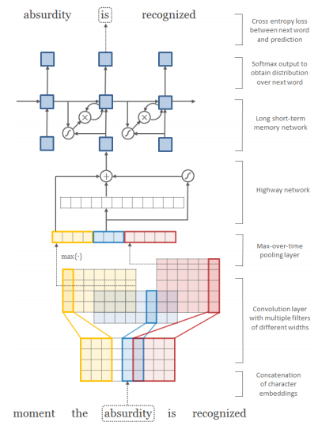
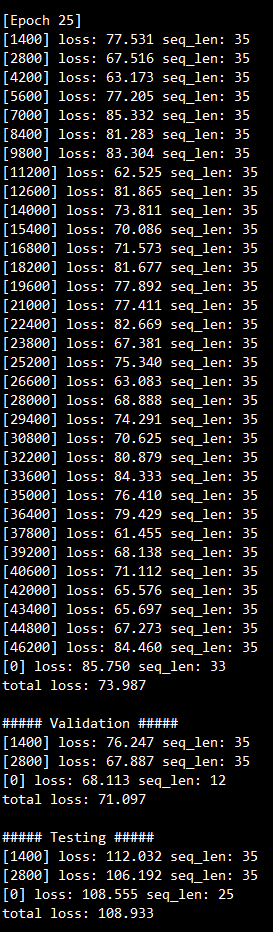

Character-Aware Neural Language Models
=====================================================================================================
Pytorch Implementation of [Character-Aware Neural Language Models](https://arxiv.org/abs/1508.06615) by Kim et al., AAAI 2016

## Requirements
- Install [cuda-8.0](https://developer.nvidia.com/cuda-downlaods)
- Install [cudnn-v5.1](https://developer.nvidia.com/cudnn)
- Install [Pytorch 0.4.0](https://pytorch.org/)
- Python version >= 3.5 is required

## Datasets
- English Penn Treebank dataset downloaded from [here](https://github.com/yoonkim/lstm-char-cnn)
- Place train.txt, valid.txt, test.txt files under (home)/datasets/ptb/ directory.

```bash
# Preprocessing dataset. This will create ./data/preprocess(tmp).pkl
$ python dataset.py
```

## Run experiments
```bash
# Train and test with default settings (LSTM-Char-Small)
$ python main.py

# Train with different number of hidden units and epoch
$ python main.py --hidden_dim 200 --epochs 20
```

## Model structure

- Refer to the [paper](https://arxiv.org/abs/1508.06615) for more detailed explanations of the model.

## Results


| Reported PPL | Our Implementation (valid) | Our Implementation (test) |
|:------------:|:--------------------------:|:-------------------------:|
|     92.3     |           71.1             |           108.9           |

## Licence
MIT
